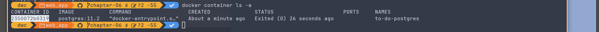

# How to run this app

- Run Docker Daemon.
- Check the folder `migrations/` and see if we have other commands there.
- Run `diesel migration run` to run the migration locally with a running docker daemon.
- Run `docker container ls -a` and copy the *CONTAINER_ID* of your local instance.
- Run `docker exec -it <CONTAINER_ID> psql -U username to_do` to get a shell interface to the database.
- Run `\c` to connect to the database. And then `\d` to list the relations.
- Run `\d+ to_do` to inspect the schema.
- Run `SELECT * FROM __diesel_schema_migrations;` to inspect the migrations table.

## DEPRECATED: These are notes from past Denis

- Run `docker container ls -a` to know if you have any existing containers running.
- Remove any of the containers you don't want with `docker container rm <CONTAINER_ID>`.
- Alternatively, nuke all stopped containers with `docker container prune`.
- `docker-compose up` - Then exit with *Ctrl+C*.
- `docker container ls -a` - Copy the CONTAINER_ID

- `diesel migration generate create_to_do_items`
- `docker compose up`
- `docker exec -it <CONTAINER_ID> psql -U username to_do` -> this get's a shell interface `to_do=#`.
- Inside the `to_do=#` shell interface, run `\c` to connect to the db.

- `cd` into `web_app` directory -> or the BE. Where your `docker-compose.yml` file is located.
- Start Docker Daemon - either by launching the Desktop app or via terminal.
- Run `docker-compose up -d` to start the containers in the background. Where your `docker-compose.yml` file is located.
- Run `docker container ls -a` and copy the correct CONTAINER_ID.

- Run `docker logs CONTAINER_ID` to see logs.
- Run `docker-compose stop` to stop the docker container running in the background. Make sure you are in the same directory as your `docker-compose.yml` file.
- Run `docker-compose down` to stop and delete the containers.
